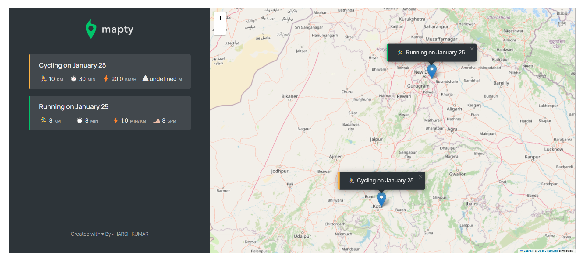

# Mapty

Mapty is application designed to track the reacord of running and cycling exercise. This app is based in the OOPs concept.

## Features :

In this app you can mark the location in map where you went to perform the above exericse.

## Build With :

<ul>
    <li><a href="https://www.w3schools.com/html/" target="_blank">HTML</a></li>
    <li><a href="https://www.w3schools.com/css/" target="_blank">CSS</a></li>
    <li><a href="https://www.w3schools.com/js/" target="_blank">JavaScript</a></li>
</ul>

## Install and Run :

- Clone the repository or download the zip folder.
- Extract the zip folder.
- Open index.html

## Screenshot :

